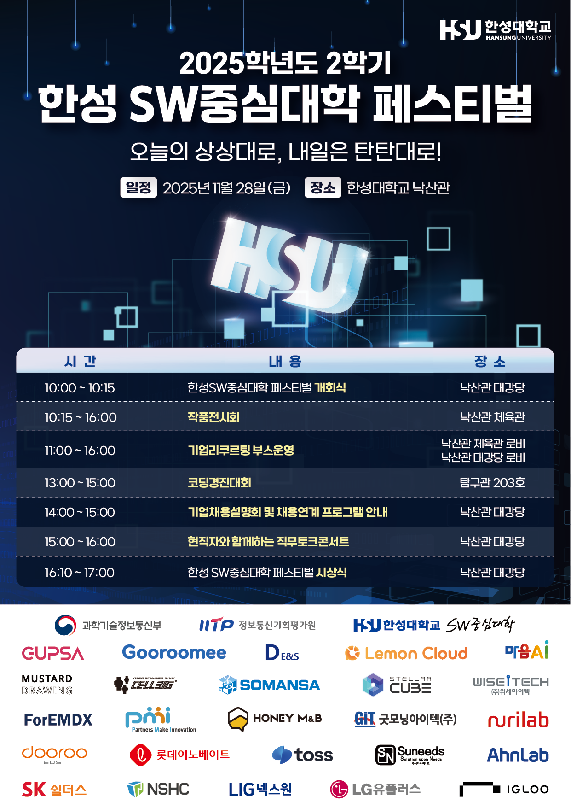
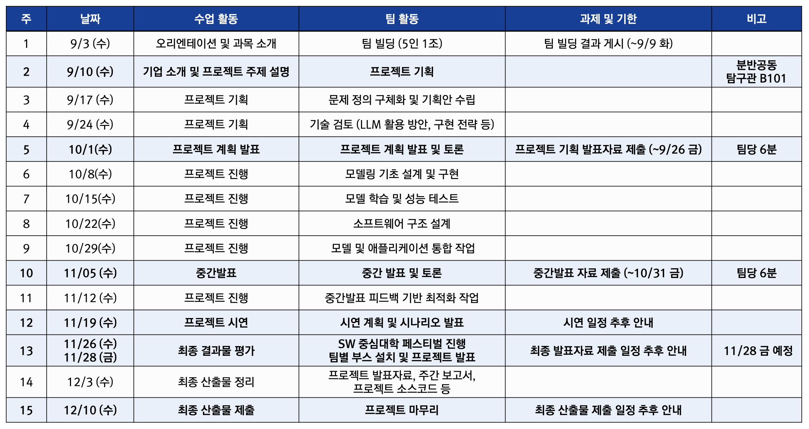

# 2025-2학기 기업연계 SW캡스톤디자인

  

## 📋 프로젝트 개요

**과목명**: 기업연계 SW캡스톤디자인 (3학점, 전공선택)

**대상**: 컴퓨터공학부 3학년

**참여 기업**: 피앰아이(PMI)

**진행 기간**: 2025학년도 2학기 (14주간)

---

## 🎓 강의 목표

본 강의는 **기업연계형 프로젝트 기반 수업**으로 실제 현장 문제 해결 경험을 제공합니다.

- ✅ **전 과정 실습**: 문제 정의 → 데이터 전처리 → 모델 개발 → 소프트웨어 구현 → 결과 발표
- 🤖 **빅데이터 & LLM 활용**: 데이터 기반 문제 해결 능력 함양
- 💡 **창의적 문제 해결**: 현장 중심 실무 역량 종합 배양
- 🤝 **협업 능력 향상**: 소통과 협력을 통한 커뮤니케이션 스킬 개발

---

## 📅 주요 일정

  

### 핵심 마일스톤

| 주차 | 날짜 | 활동 | 과제 |
|:---:|:---:|:---:|:---:|
| **1** | 9/3 | 오리엔테이션 | 팀 빌딩 (~9/9) |
| **2** | 9/10 | 기업 설명회 (탐구관 B101) | 프로젝트 기획 |
| **5** | 10/1 | 📊 프로젝트 계획 발표 (팀당 6분) | 발표자료 (~9/26) |
| **10** | 11/5 | 📊 중간 발표 (팀당 6분) | 발표자료 (~10/31) |
| **13** | 11/26-28 | 🎪 SW 중심대학 페스티벌 시연 | 시연 준비 |
| **15** | 12/10 | 📦 최종 산출물 제출 | 전체 결과물 |

---

## 👥 팀 구성 & 운영

### 팀 빌딩
- **팀 구성**: 5인 1조 (혹은 4인 1조)
- **제출 장소**: e-class

### 프로젝트 미팅
- **기획 단계**: 팀별 1회
- **진행 단계**: 팀별 2회
- **시연 단계**: 팀별 1회
- **추가 미팅**: 팀별 요청 시 협의 가능

### 협업 도구
- **프로젝트 관리**: Notion (통합 대시보드)
- **소스 관리**: GitHub Repository
- **미팅 관리**: Notion에 사전 안건 업로드 필수

---

## 📦 최종 산출물

### 필수 제출물
1. **프로젝트 발표자료**
   - 계획 발표 (5주차)
   - 중간 발표 (10주차)
   - 최종 시연 (13주차)

2. **주간 진행사항 보고서**
   - 매주 금요일 오후 5시까지 e-class 제출
   - 프로젝트 활동 내용 상세 기록

3. **프로젝트 소스코드**
   - GitHub Repository에 배포
   - 최종 결과물 (15주차)

### 계획 발표 포함 내용 (5주차)
- 팀 소개: 팀명, 팀원, 역할 분담
- 주요 활용 기술: 오픈소스, 웹 라이브러리, 생성형 AI
- 개발환경: 클라우드, 시스템 아키텍처, DB 설계
- 협업 도구: Notion, GitHub 등
- 일정 관리: 마일스톤, 이슈 관리 방안

---

## 📊 평가 방법

### 평가 구성
- **팀 단위 평가**: 작품 완성도 (담당 교수, 기업 담당자, 팀 간 상호평가)
- **개인 평가**: 팀 내 기여도 (담당 교수, 팀 내 상호평가)

### 평가 항목
| 항목 | 세부 내용 |
|:---:|:---|
| **프로젝트 발표** | 계획 발표, 중간 발표, 최종 시연 |
| **결과물** | 소스코드, 개발 산출물, 주간보고서 |
| **기여도** | 프로젝트 기여도 및 수업 참여도 |

> 📌 **참고**: 프로젝트 기반 수업으로 별도의 중간/기말고사 없음

---

## 🚀 기술 스택 (예시)

프로젝트 진행 시 활용 가능한 기술들:

### AI/ML
- 🤖 LLM: OpenAI GPT, Anthropic Claude, LangChain
- 🔍 Vector DB: Pinecone, Weaviate, ChromaDB
- 📊 ML Framework: PyTorch, TensorFlow, Hugging Face

### Backend
- ⚙️ Framework: FastAPI, Flask, Django
- 💾 Database: PostgreSQL, MongoDB
- ☁️ Cloud: AWS, GCP, Azure

### Frontend
- 🎨 Framework: React, Vue.js, Next.js
- 🎭 UI Library: Tailwind CSS, Material-UI

---

## 📞 참여 기업

### 피앰아이 (PMI)
- 8분반

> 📅 **기업 설명회**: 2025년 9월 10일 (수) 12:00 @ 탐구관 B101

---

## 📚 참고 자료

### 주요 문서
- [프로젝트 일정표](./assets/schedule.png)
- [프로젝트 포스터](./assets/poster.png)

### 제출 플랫폼
- **과제 제출**: e-class
- **코드 관리**: GitHub
- **프로젝트 관리**: Notion

---

## 💬 문의사항

프로젝트 관련 문의사항은 담당 교수님 또는 e-class를 통해 연락 부탁드립니다.

---

**2025-2학기 기업연계 SW캡스톤디자인**
*컴퓨터공학부*

